# 项目设计

## 硬件资源

### ASRPRO开发板

内置麦头，主要负责语音控制部分，通过神经网络训练模型，模型加载在开发板中，通过串口与STM32主控板通信

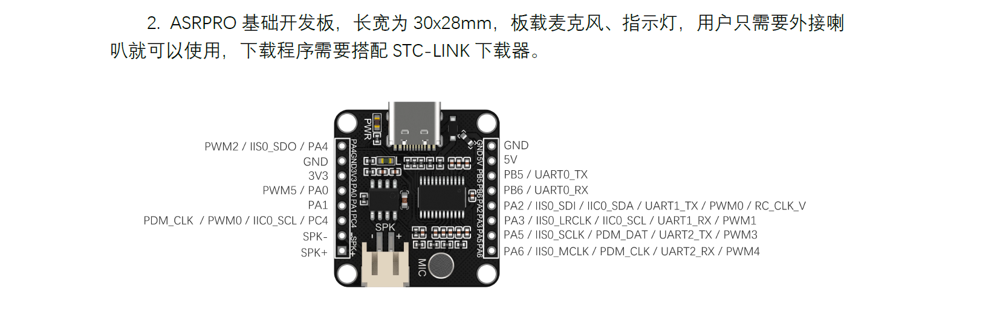

### STM32主控板 

核心控制部件，通过C语言编程，型号为STM32F103C8T6，运行FreeRTOS实时操作系统。
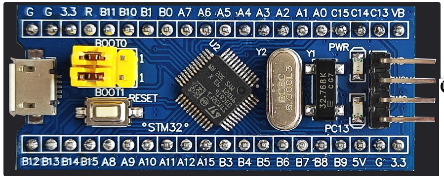

### 扬声器

与ASRPRO相连，负责语音播报。
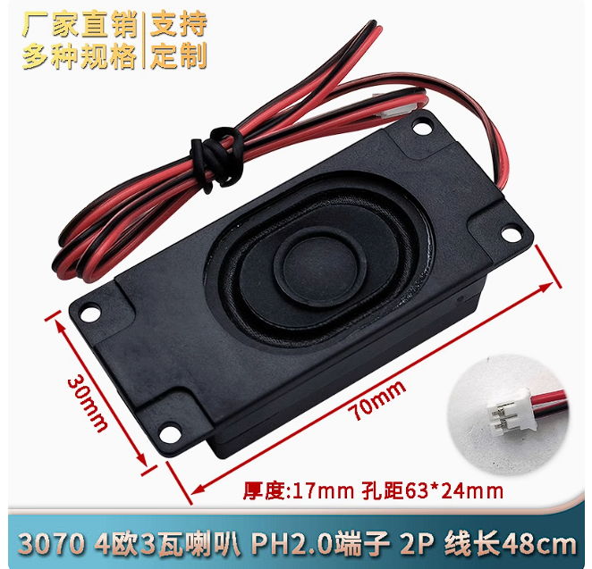

### SG90舵机

180度旋转
与ASRPRO相连,模拟窗户的开闭。
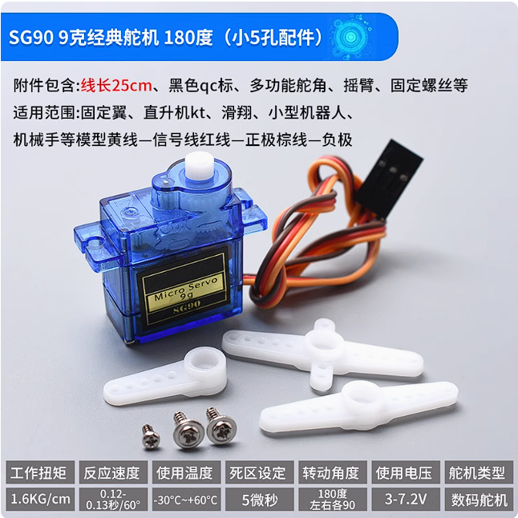

### DHT11传感器

与ASRPRO相连，负责环境温度和湿度的检测
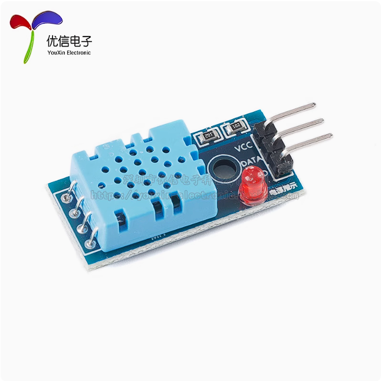

### 旋转编码器 

与STM32的TIM3的编码器接口相连，负责手动调节灯光系统的PWM波形
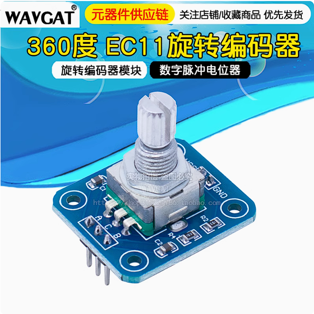

### TB6612

TB6612是一款双路H桥型的直流电机驱动芯片，可以驱动两个直流电机并且控制其转速和方向
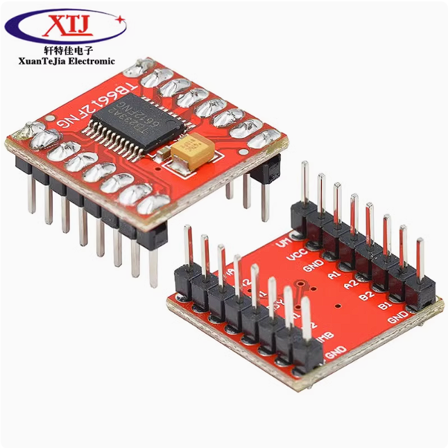

### 直流电机

模拟智能家居风扇，用专门的驱动芯片驱动
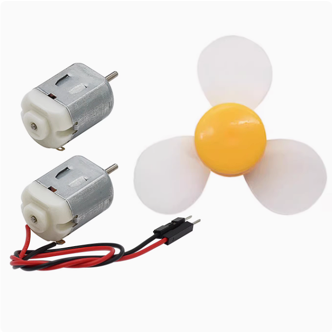

### 光敏电阻传感器

触发备用光源启动
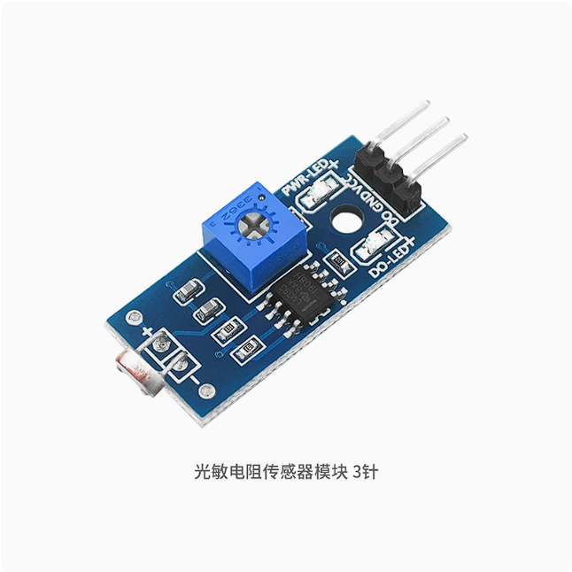

### 火焰传感器

检测火焰的存在并及时报警
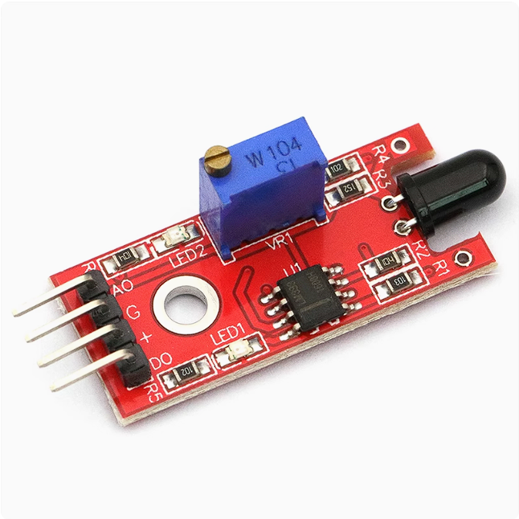

### 声音传感器

用于噪声监测
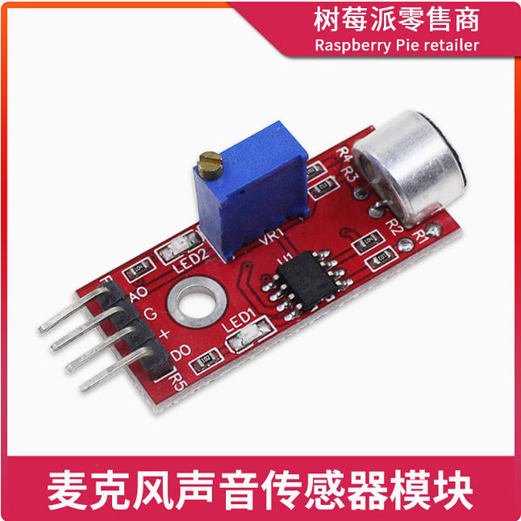

### 有源蜂鸣器

用于火灾报警
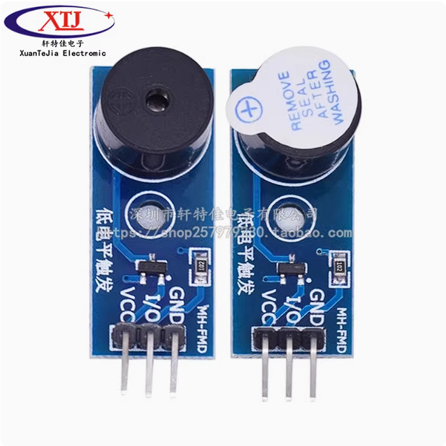

### 三色LED灯

用于灯光警报

### 发光二极管

模拟灯光系统
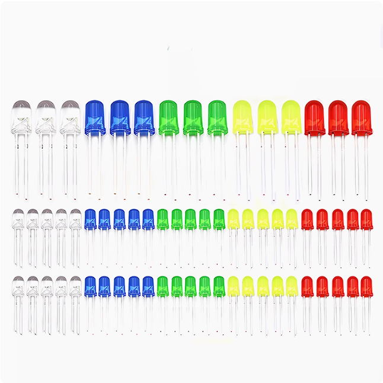

### OLED显示屏幕

四针脚通过IIC协议通信
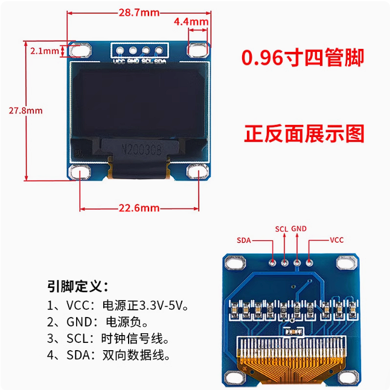

## 智能家居项目介绍

### 功能1：智能照明系统

PWM语音控制全局灯光LED，语音声控调光
PWM接入旋转编码器，手动调光。

开灯：打开PWM 维持上次占空比值（首次开灯默认50%占空比）
关灯：关闭PWM 记录此时占空比值
增大亮度： 亮度加大30%
减少亮度： 亮度减少30%
OLED屏幕实时显示当前亮度值

使用描述：
通过三个定时器的协调作用完成功能，TIM2输出PWM信号，TIM3作为编码器接口，TIM4定时获取Encode Counter的值。
通过语音开启系统，默认开灯亮度为50%，可以通过编码器手动调节灯光亮度。也可以通过语音，加大亮度，减少亮度来控制灯光系统。声控与手动控制两者可以独立运行。
当语音关灯后，系统会记录此时的灯光亮度，再次开灯时，会保持上一次的灯光亮度。

### 功能2：风扇降温系统

TIM1高级定时器输出PWM控制直流电机进行风扇调速，外加驱动芯片驱动风扇
语音控制风扇开启关闭：
打开风扇： 开启风扇1档
风扇一档： 占空比设置为30%
风扇二挡： 占空比设置为60%
风扇三挡： 占空比设置为100%
关闭风扇
风扇反转：设置风扇逆时针转动
风扇正转：设置风扇顺时针转动

注意只有执行开始风扇后，才能控制1档 2档 3档，并且设置了保护位，防止在风扇运行中反转。

### 功能3：环境温度检测

ASRPRO开发板控制DHT11温度传感器，获取环境温度和湿度并进行语音播报

使用描述：
当声控当前温度时，可以自动播报当前的温度值。
当声控当前湿度时，可以自动播报当前的湿度值。

### 功能4：火灾报警

STM32 ADC1通道2实时获取火焰传感器的模拟值，当检测到火焰时，警示灯显示蓝色，同时蜂鸣器报警。

### 功能5：噪声监控

STM32 ADC1通道1实时获取声音传感器的模拟值，当检测到声音超过标定值时，警示灯显示绿色。

### 功能6：智能控温系统

当环境亮度降低到一定程度，自动开启备用灯光系统
当环境亮度恢复到正常时，关闭备用灯光系统。
注意，当开启主控灯光系统时，备用灯光系统不会开启！(标志位)

### 功能7：窗户自动开闭系统

语音控制舵机，模拟窗户的开闭。

打开窗户: 会控制舵机旋转180的来模拟窗帘的开启。
关闭窗户: 会调回舵机的控制角度模拟窗帘的关闭。
半开窗户: 控制舵机旋转90度

## 硬件连接示意

ASRPRO开发板 PWM5控制舵机旋转。

ASRPRO ： 
| 引脚      | 设备                    |
| --------- | ----------------------- |
| PA6       | DHT11                   |
| PA0(PWM5) | SG90舵机                |
| PA2       | 串口1 TX与STM32通信     |
| PA3       | 串口1 RX与STM32通信     |
| GND       | 与STM32GND相连统一电压  |
| GND       | 与CH340相连统一电位     |
| 3.3V      | 与STM32 3V3相连统一电压 |
| PB5       | 串口0TX 下载设备        |
| PB6       | 串口0RX 下载设备        |
| 5V        | CH340链接供电           |

STM32: 
外设使用：
四个定时器：
TIM1高级定时器： PWM控制直流电机进行风扇调速
TIM2通用定时器： PWM信号控制灯光系统
TIM3通用定时器： 旋转编码器接口输入
TIM4通用定时器： 更新中断获取旋转编码器值
ADC1通道1：获取声音传感器模拟值
ADC2通道2：获取火焰传感器模拟值
IIC1：链接OLED显示

| 引脚 | 设备                      |
| ---- | ------------------------- |
| PA9  | 串口1TX                   |
| PA10 | 串口1RX                   |
| PB8  | IIC1 SCL                  |
| PB9  | IIC1 SDA                  |
| PA8  | PWM信号，TIM1_CH1         |
| PA0  | 灯光系统                  |
| PC13 | 蜂鸣器报警                |
| PC14 | 备用灯光系统              |
| PA6  | 旋转编码器接口            |
| PA7  | 旋转编码器接口            |
| PC15 | 光敏传感器接口            |
| PA4  | 直流电机方向引脚          |
| PA5  | 直流电机方向引脚          |
| PA1  | ADC1通道1，链接声音传感器 |
| PA2  | ADC2通道2，链接火焰传感器 |
| PB10 | 三色LED灯绿光接口         |
| PB11 | 三色LED灯蓝光接口         |

旋转编码器接线：

PA6,PA7接入TIM3旋转编码器接口
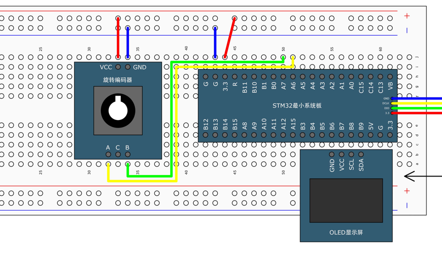

TB6612接线：
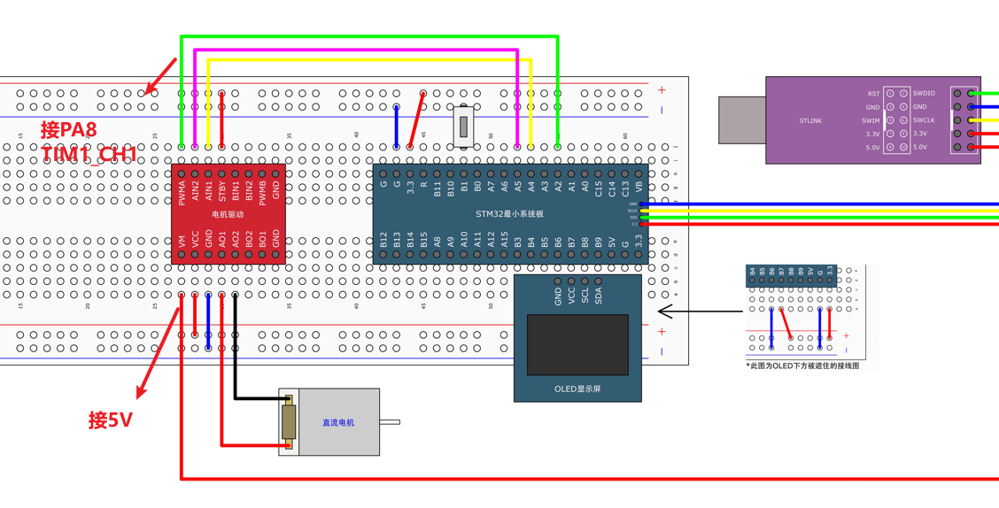

最终接线示意图：
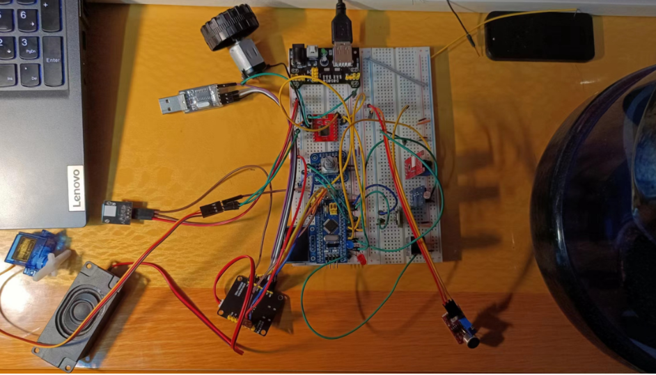

## 功能流程演示

设备上电：
遮住光敏电阻：备用光源开启
松开光敏电阻：备用光源关闭
开灯：灯光系统开启
遮住光敏电阻：不再开启备用光源
编码器调节亮度： 调大 调小 OLED显示亮度变化
关灯：灯光系统关闭
开灯：保持上次亮度开启
语音增大亮度：增大3成
语音减少亮度：减少3成

打开风扇：正转一档
风扇二挡：正转二挡
风扇三挡：正转三挡
风扇反转
打开风扇：反转一档
风扇三挡：反转三挡(跳过二挡节约时间)
关闭风扇
风扇正转
打开风扇：恢复正转一档
关闭风扇

敲打声音传感器(模拟高音)：LED绿色警报
打火机点火：LED灯蓝色警报，蜂鸣器报警

打开窗户：舵机启动180
关闭窗户：舵机启动0
半开窗户：舵机90度

当前温度： 播报当前温度
当前湿度： 播报当前湿度

功能演示完毕 
